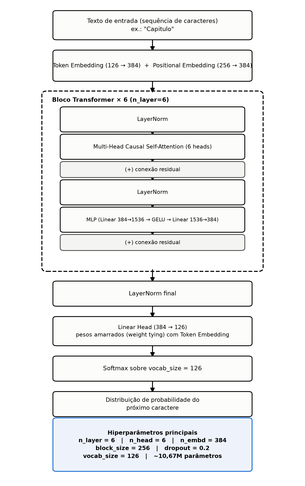
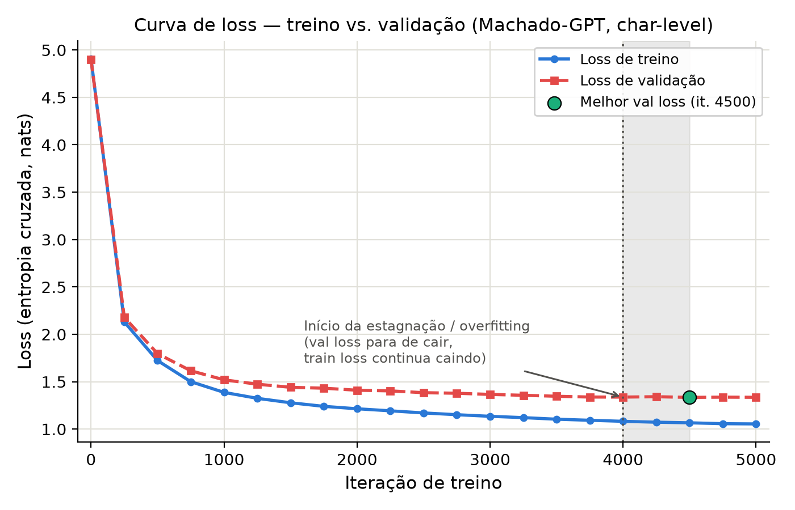
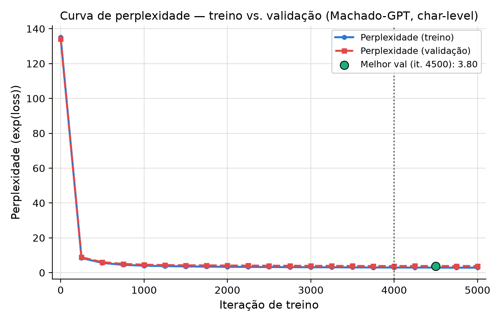

# Resultados — Machado-GPT (Projeto Individual 1, PPMEC0070)

Documento de referência com os resultados quantitativos e qualitativos da rodada de treino concluída. Serve de base direta para o artigo IEEE exigido pelo enunciado.

## a) O projeto

O enunciado do Projeto Individual 1 (PPMEC0070 — Cibernética e Aprendizagem de Máquinas, PPMEC/UnB, 2026.2) pede a implementação, treino e avaliação de um modelo de linguagem autoregressivo estilo GPT-2, usando como base de código obrigatória o [nanoGPT](https://github.com/karpathy/nanoGPT) de Andrej Karpathy.

Este projeto treina um GPT em **nível de caractere** do zero sobre um corpus próprio composto por 12 obras de Machado de Assis em domínio público. O objetivo é reproduzir, para um corpus em português e de maior volume, o experimento de referência `shakespeare_char` do próprio repositório nanoGPT, e comparar os resultados obtidos com o baseline publicado pelos autores.

## b) Dataset / corpus

Corpus próprio (`corpus/build_corpus.py`), montado a partir de 12 obras de Machado de Assis hospedadas no [Project Gutenberg](https://www.gutenberg.org/), com remoção do cabeçalho/rodapé de licença padrão do Gutenberg.

| Obra | ID Gutenberg |
|---|---|
| Dom Casmurro | 55752 |
| Memórias Póstumas de Brás Cubas | 54829 |
| Quincas Borba | 55682 |
| Papéis Avulsos | 57001 |
| Poesias Completas | 61653 |
| A Mão e a Luva | 53101 |
| Histórias sem Data | 33056 |
| Helena | 67162 |
| Iaiá Garcia | 67780 |
| Esaú e Jacó | 56737 |
| Relíquias de Casa Velha | 67935 |
| Memorial de Aires | 55797 |

**Estatísticas do corpus final** (rodada usada neste treino):

| Métrica | Valor |
|---|---|
| Caracteres totais | 4.029.420 |
| Palavras totais | 667.339 |
| Vocabulário (nível de caractere) | 126 caracteres únicos |
| Tokens de treino (90%) | 3.543.154 |
| Tokens de validação (10%) | 393.684 |

Tokenização em nível de caractere (cada um dos 126 caracteres únicos — letras acentuadas do português, pontuação, etc. — vira um token), adaptada de `data/shakespeare_char/prepare.py` (nanoGPT). Split treino/validação: 90/10.

> Nota: uma rodada anterior de montagem do corpus registrou 3.936.722 caracteres; os números acima são os da rodada de fato usada para o treino cujos resultados estão documentados aqui.

## c) Arquitetura

"Baby GPT" — mesma configuração do baseline `shakespeare_char` do nanoGPT: Transformer decoder-only estilo GPT-2.

Pipeline: texto de entrada (caracteres) → Token Embedding + Positional Embedding → **6× bloco Transformer** (LayerNorm → Multi-Head Causal Self-Attention com 6 cabeças → conexão residual → LayerNorm → MLP com expansão 4x e GELU → conexão residual) → LayerNorm final → Linear Head (pesos amarrados/*weight tying* com a embedding de entrada, padrão do nanoGPT) → Softmax sobre o vocabulário.

| Hiperparâmetro | Valor |
|---|---|
| n_layer | 6 |
| n_head | 6 |
| n_embd | 384 |
| block_size (contexto) | 256 caracteres |
| dropout | 0.2 |
| batch_size | 64 |
| tokens por iteração | 16.384 |
| vocab_size | 126 |
| **Total de parâmetros** | **10,67M** (10.763.520 com weight decay + 4.992 sem) |

## d) Setup de treino

- **Hardware:** MacBook com Apple Silicon, backend **MPS (Metal)** — não CUDA/Colab nesta rodada.
- `torch.compile` habilitado (funcionou nesta rodada, diferente de um teste de fumaça anterior, que usava `compile=False` por instabilidade prévia em MPS).
- **Otimizador:** AdamW, `learning_rate=1e-3` com decaimento cosseno até `min_lr=1e-4`, `warmup=100` iterações, `beta2=0.99`.
- **Duração:** 5000 iterações no total, avaliação (`eval_interval`) a cada 250 iterações.

## e) Resultados quantitativos

### Curva de loss

| Iteração | Train loss | Val loss |
|---|---|---|
| 0 | 4,9065 | 4,8991 |
| 250 | 2,1305 | 2,1796 |
| 500 | 1,7231 | 1,7964 |
| 750 | 1,5004 | 1,6157 |
| 1000 | 1,3875 | 1,5199 |
| 1250 | 1,3248 | 1,4739 |
| 1500 | 1,2779 | 1,4411 |
| 1750 | 1,2402 | 1,4316 |
| 2000 | 1,2146 | 1,4103 |
| 2250 | 1,1929 | 1,4032 |
| 2500 | 1,1707 | 1,3843 |
| 2750 | 1,1519 | 1,3783 |
| 3000 | 1,1351 | 1,3660 |
| 3250 | 1,1211 | 1,3569 |
| 3500 | 1,1045 | 1,3466 |
| 3750 | 1,0932 | 1,3383 |
| 4000 | 1,0822 | 1,3378 |
| 4250 | 1,0729 | 1,3418 |
| **4500** | 1,0665 | **1,3345** |
| 4750 | 1,0571 | 1,3372 |
| 5000 | 1,0546 | 1,3355 |

**Melhor val loss: 1,3345, na iteração 4500** (perplexidade ≈ 3,80).

**Detalhe metodológico:** a config de treino usada tinha `always_save_checkpoint=True`, então o checkpoint efetivamente salvo em disco (e usado para gerar as amostras da seção f) é o da **iteração 5000** (val loss 1,3355), não o de melhor val loss (iteração 4500, val loss 1,3345). A diferença entre os dois (0,001 nat, perplexidade 3,80 vs. 3,80) é desprezível na prática, mas fica registrada aqui por precisão.

**Overfitting a partir de ~iteração 4000:** a partir desse ponto o train loss continua caindo de forma consistente (1,0822 → 1,0546 entre as iterações 4000 e 5000), enquanto o val loss estagna e passa a oscilar (1,3378 → 1,3418 → 1,3345 → 1,3372 → 1,3355) sem tendência clara de queda adicional. Isso é o sinal clássico de início de overfitting: o modelo continua reduzindo o erro sobre os dados de treino, mas para de generalizar melhor para os dados de validação. A região está demarcada no gráfico acima (faixa sombreada + linha tracejada em 4000).

### Curva de perplexidade

Perplexidade = exp(val_loss). No melhor ponto (iteração 4500): exp(1,3345) ≈ **3,80**.

### Comparação com o baseline oficial do nanoGPT

O [README oficial do repositório nanoGPT](https://github.com/karpathy/nanoGPT) reporta, para a **mesma arquitetura exata** (6 camadas, 6 cabeças, 384 dimensões, `block_size=256`), treinada em GPU A100 sobre o corpus de Shakespeare (~1MB, bem menor que o nosso corpus de ~4MB):

| | Corpus | Hardware | Melhor val loss | Perplexidade |
|---|---|---|---|---|
| Baseline nanoGPT (`shakespeare_char`) | Shakespeare, ~1MB | GPU A100 | 1,4697 | ≈ 4,35 |
| **Este trabalho (Machado-GPT)** | Machado de Assis, ~4MB (4,03M caracteres) | MPS (Apple Silicon) | **1,3345** | **≈ 3,80** |

Com a mesma arquitetura, um corpus ~4x maior e hardware mais modesto (MPS em vez de A100), o resultado obtido (val loss 1,3345) é **melhor que o baseline oficial do próprio repositório nanoGPT** (1,4697). Esse é o principal ponto de comparação quantitativa do trabalho — plausivelmente explicado pelo corpus maior, que dá ao modelo mais dados para aprender a estrutura estatística da língua antes de saturar sua capacidade (10,67M parâmetros).

## f) Resultados qualitativos

Ver [`amostras_geracao.md`](amostras_geracao.md) para as 3 amostras completas de geração (prompt "Capitulo", `sample.py` do nanoGPT, parâmetros padrão `temperature=0.8`/`top_k=200`).

Resumo da leitura qualitativa:
- Ortografia e sintaxe fiéis ao português de época (grafias como "elle", "delle", "cousa", "affeição"), aprendidas diretamente da distribuição de caracteres do corpus.
- Captura bem o maneirismo de diálogo característico de Machado — travessão + verbo dicendi (ex.: `--Você é boa, disse o conselheiro.`).
- Boa coerência gramatical local (concordância, estrutura de frase).
- **Sem coerência narrativa de longo alcance** — não há enredo persistente ao longo do trecho gerado. Isso é uma limitação esperada de um GPT em nível de caractere deste porte e contexto (256 caracteres, ~40-50 palavras), não um defeito de implementação.

## g) Limitações conhecidas

1. **Tokenização em nível de caractere:** mais simples de implementar e permite comparação direta com o baseline `shakespeare_char`, mas é menos eficiente que tokenização em nível de subpalavra (BPE) — o mesmo `block_size` de 256 cobre uma janela de contexto muito menor em número de palavras do que cobriria com um tokenizador de subpalavras.
2. **Contexto curto (`block_size=256`):** insuficiente para coerência narrativa acima de uma ou poucas frases — explica a limitação qualitativa descrita acima.
3. **Overfitting a partir de ~iteração 4000:** o treino poderia ter sido interrompido antes (early stopping) sem perda relevante de qualidade, já que o ganho de val loss entre a iteração 4000 e a 5000 é marginal.
4. **Checkpoint salvo ≠ melhor checkpoint:** por `always_save_checkpoint=True`, o checkpoint em disco é o da última iteração (5000), não o de menor val loss (4500) — diferença desprezível neste caso, mas vale registrar como boa prática para próximas rodadas (salvar por melhor val loss, não só por última iteração).
5. **Corpus de domínio público, sem revisão filológica:** o texto vem do Project Gutenberg; não houve checagem exaustiva de erros de OCR/transcrição linha a linha (foram consultadas bases de apoio recomendadas no enunciado, mas sem validação exaustiva).
6. **Uma única rodada de treino:** os números acima vêm de uma execução; não há repetição com seeds diferentes para estimar variância dos resultados.

## h) Próximos passos

Diretamente relacionados a este material de resultados:

- Escrever o artigo IEEE (6 páginas, dupla coluna) usando este README como base de dados/figuras.
- Preparar os slides da apresentação oral (5 min), destacando a comparação com o baseline nanoGPT (1,3345 vs. 1,4697) como resultado principal.
- Decidir se a extensão para Q&A no universo machadiano (RAG vs. fine-tuning supervisionado, discutida no notebook) fica só como proposta no artigo ou vira um experimento mínimo de fato.
- Se houver tempo/interesse: repetir o treino com early stopping por volta da iteração 4000-4500, ou com `block_size` maior, e comparar.
