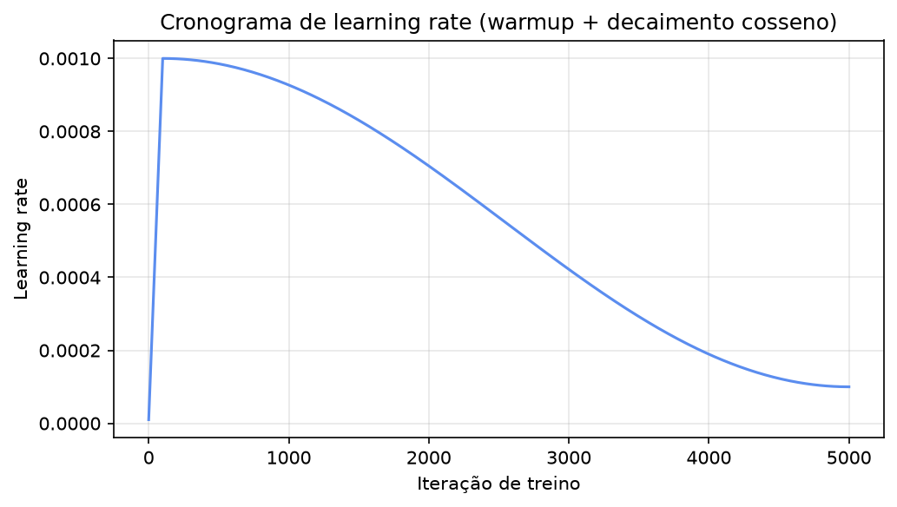
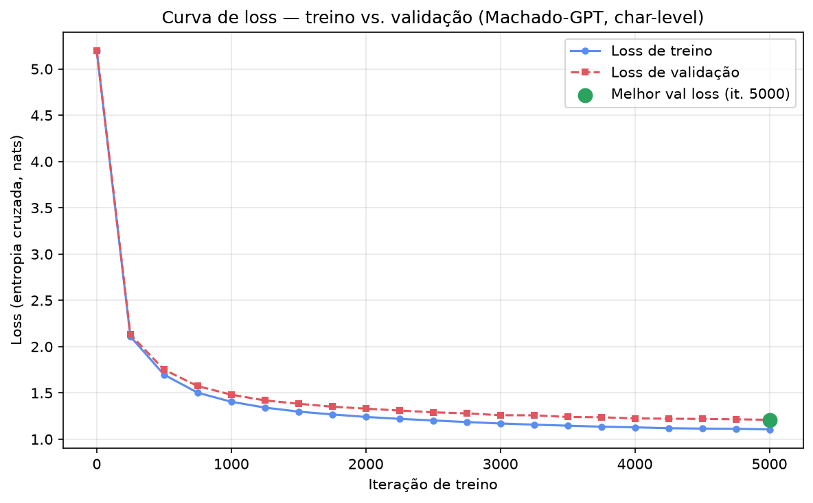
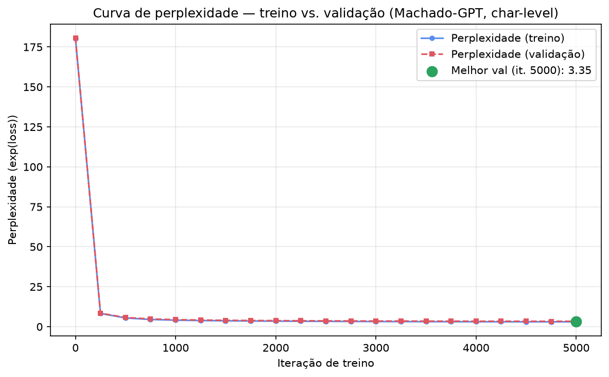

# Resultados 2 — Machado-GPT com corpus maximizado (Projeto Individual 1, PPMEC0070)

Segunda rodada de treino, agora com o corpus maximizado (Gutenberg + Wikisource) em vez de só os 12 livros do Gutenberg usados em [`../resultados 1/`](../resultados%201/README.md). Gerada rodando o próprio [`notebook/projeto1_machado_gpt.ipynb`](../notebook/projeto1_machado_gpt.ipynb) ponta a ponta (local, MPS) — todas as figuras aqui vieram direto da execução real do notebook, não de um script externo.

## a) O que mudou em relação a `resultados 1/`

Mesma arquitetura e mesmo orçamento de treino (5000 iterações) — a única variável isolada é o tamanho/diversidade do corpus. Objetivo: verificar se o overfitting observado em `resultados 1/` a partir da iteração ~4000 era, como suspeitado, um problema de pouco dado (3,9M caracteres) e não da arquitetura.

## b) Dataset / corpus

| Métrica | `resultados 1/` (só Gutenberg) | `resultados 2/` (Gutenberg + Wikisource) |
|---|---|---|
| Caracteres totais | 4.029.420 | **13.978.947** |
| Palavras totais | 667.339 | **2.392.278** |
| Fontes | 12 | **1793** (12 Gutenberg + 1781 Wikisource) |
| Vocabulário (nível de caractere) | 126 | **177** |
| Tokens de treino (90%) | 3.543.154 | **12.497.728** |
| Tokens de validação (10%) | 393.684 | **1.388.637** |

O vocabulário cresceu de 126 para 177 caracteres únicos — o Wikisource traz mais variação de pontuação/diacríticos do que os 12 livros do Gutenberg sozinhos. Ver `../corpus/build_corpus.py` e o dataset publicado no HuggingFace para a proveniência completa (quais obras, como as ~1780 páginas do Wikisource foram filtradas/limpas).

## c) Arquitetura

Mesma configuração "baby GPT" de `resultados 1/` — só o `vocab_size` muda (consequência do corpus, não uma escolha de design).

| Hiperparâmetro | Valor |
|---|---|
| n_layer | 6 |
| n_head | 6 |
| n_embd | 384 |
| block_size (contexto) | 256 caracteres |
| dropout | 0.2 |
| batch_size | 64 |
| vocab_size | **177** (era 126) |
| **Total de parâmetros** | **10.715.520** (~10,72M — a diferença de ~50k em relação aos 10,67M de `resultados 1/` vem só do vocabulário maior) |

## d) Setup de treino

- **Hardware:** MacBook Apple Silicon, backend **MPS** — mesma máquina de `resultados 1/`.
- `torch.compile` **desabilitado** nesta rodada (`compile=False` — a detecção automática de hardware do notebook só liga compile em CUDA).
- **Otimizador:** AdamW, `learning_rate=1e-3` com decaimento cosseno até `min_lr=1e-4`, `warmup=100` iterações, `beta2=0.99`.
- **Duração:** 5000 iterações, avaliação a cada 250.

## e) Resultados quantitativos

### Curva de loss

| Iteração | Train loss | Val loss |
|---|---|---|
| 0 | 5,1951 | 5,1961 |
| 250 | 2,1100 | 2,1298 |
| 500 | 1,6970 | 1,7515 |
| 750 | 1,5027 | 1,5739 |
| 1000 | 1,4046 | 1,4812 |
| 1250 | 1,3418 | 1,4193 |
| 1500 | 1,2985 | 1,3832 |
| 1750 | 1,2677 | 1,3514 |
| 2000 | 1,2410 | 1,3303 |
| 2250 | 1,2200 | 1,3101 |
| 2500 | 1,2029 | 1,2908 |
| 2750 | 1,1855 | 1,2794 |
| 3000 | 1,1701 | 1,2593 |
| 3250 | 1,1573 | 1,2585 |
| 3500 | 1,1464 | 1,2404 |
| 3750 | 1,1354 | 1,2373 |
| 4000 | 1,1283 | 1,2248 |
| 4250 | 1,1194 | 1,2219 |
| 4500 | 1,1148 | 1,2191 |
| 4750 | 1,1125 | 1,2154 |
| **5000** | **1,1059** | **1,2097** |

**Melhor val loss: 1,2097 — bate exatamente na última iteração (5000)** (perplexidade ≈ 3,35). Diferente de `resultados 1/`, **o val loss não estagna em nenhum momento** — cai de forma consistente do início ao fim, sem o platô/overfitting que aparecia a partir da iteração ~4000 na rodada anterior. Confirma a hipótese: o overfitting de `resultados 1/` era limitação de dados, não da arquitetura.

**Consequência prática:** como o val loss ainda está caindo na iteração 5000, o modelo provavelmente se beneficiaria de mais iterações — o treino foi interrompido pelo orçamento definido (5000, igual à rodada anterior para comparação justa), não porque convergiu.

### Curva de perplexidade

Perplexidade = exp(val_loss). Na iteração final: exp(1,2097) ≈ **3,35**.

### Comparação — as duas rodadas e o baseline do nanoGPT

| | Corpus | Melhor val loss | Perplexidade | Overfitting? |
|---|---|---|---|---|
| Baseline nanoGPT (`shakespeare_char`, GPU A100) | Shakespeare, ~1MB | 1,4697 | ≈ 4,35 | — |
| `resultados 1/` (Gutenberg só) | ~4,0M caracteres | 1,3345 (it. 4500) | ≈ 3,80 | Sim, a partir de ~it. 4000 |
| **`resultados 2/` (Gutenberg + Wikisource)** | **~14,0M caracteres** | **1,2097 (it. 5000)** | **≈ 3,35** | **Não observado** |

Cada aumento de dado melhorou o resultado, na mesma arquitetura: o corpus maximizado bateu tanto o baseline oficial do nanoGPT quanto a nossa própria rodada anterior, e ainda por cima sem sinal de overfitting dentro do orçamento de treino usado.

## f) Resultados qualitativos

Ver [`amostras_geracao.md`](amostras_geracao.md) para as 3 amostras completas (prompt "Capitulo", `sample.py`, parâmetros padrão).

Resumo: vocabulário visivelmente mais rico que `resultados 1/` (nomes de personagens reais como "Helena" e "Luiz Garcia", numeração de capítulo em romanos no estilo real das obras), mistura de ortografia de época e atualizada (reflexo das duas fontes do corpus). Mesma limitação estrutural de antes — boa coerência gramatical local, sem enredo persistente de longo alcance (esperado para `block_size=256` em nível de caractere).

## g) Limitações conhecidas

Mesmas de `resultados 1/` (tokenização em nível de caractere, contexto curto, checkpoint salvo = última iteração não necessariamente a de menor val loss — embora aqui coincidam) **mais uma nova**:

- **Treino provavelmente sub-convergido:** o val loss ainda caía na iteração 5000 — os números aqui são um piso, não o teto do que esse corpus permite. Rodar por mais iterações (ou com `block_size`/arquitetura maiores, agora que há dado suficiente para sustentar mais capacidade sem overfitting) é o próximo passo natural.

## h) Próximos passos

- Considerar uma rodada com mais iterações (ex: 10000–15000) já que não há overfitting neste orçamento.
- Usar estes números (melhores que `resultados 1/` e que o baseline do nanoGPT) como resultado principal do artigo IEEE — a comparação entre as duas rodadas próprias é, em si, um resultado científico (efeito do tamanho do corpus, controlado por arquitetura idêntica).
- Ver o artigo (`../artigo/`) para a discussão completa (extensão Q&A, trabalhos futuros).
