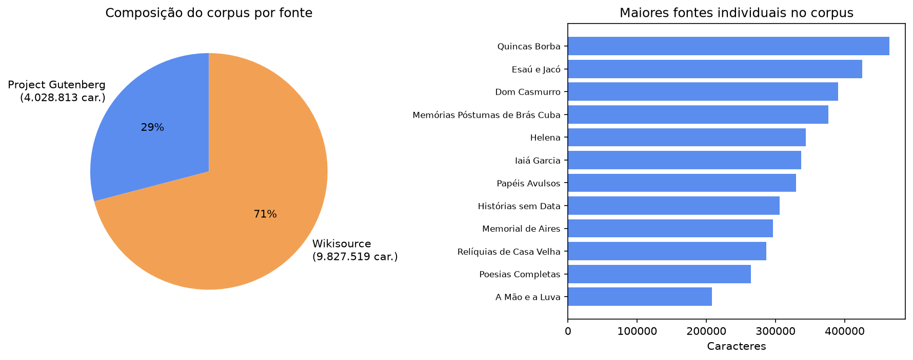
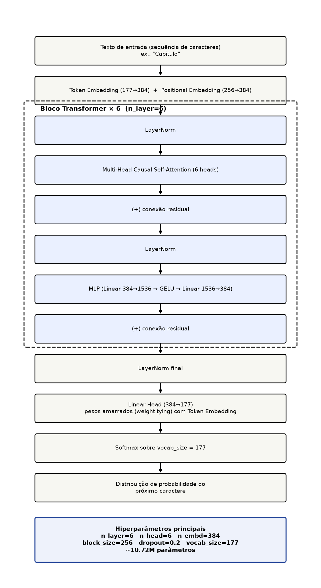
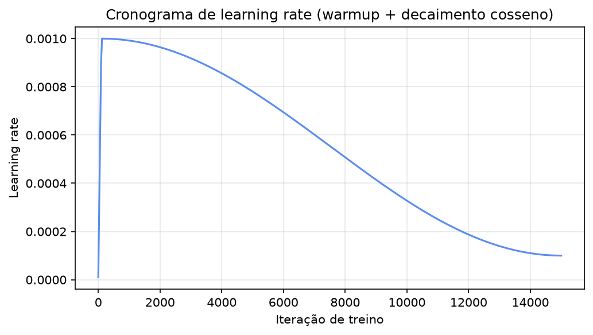
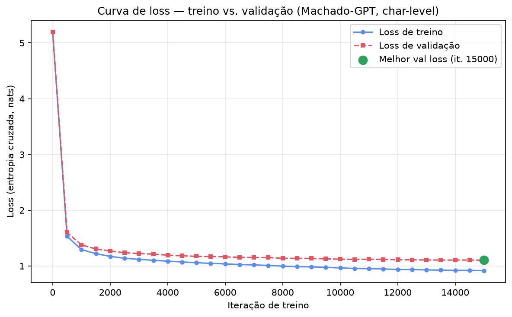
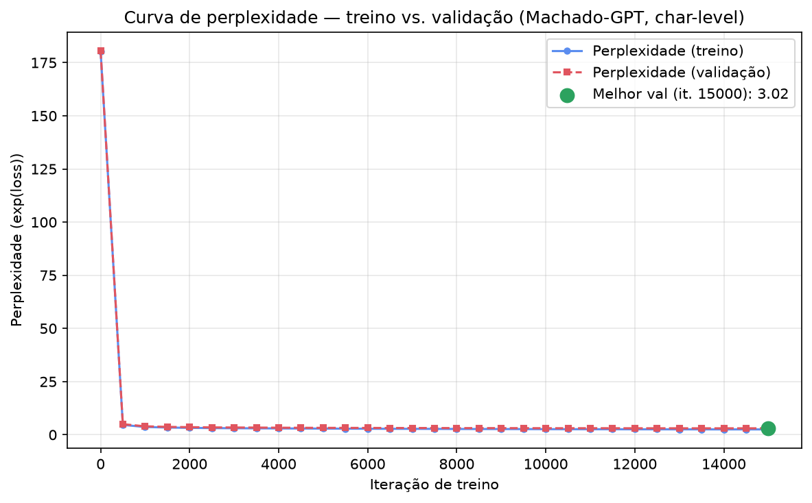

# Resultados 3 — Machado-GPT, 15000 iterações (Projeto Individual 1, PPMEC0070)

Terceira rodada de treino: mesmo corpus maximizado de [`../resultados 2/`](../resultados%202/README.md) (Gutenberg + Wikisource, ~13,9M caracteres), mesma arquitetura — a única variável isolada agora é o **orçamento de treino**, que sobe de 5000 para **15000 iterações**, já que `resultados 2/` terminou sem overfitting e com o val loss ainda caindo. Gerada rodando o próprio [`notebook/projeto1_machado_gpt.ipynb`](../notebook/projeto1_machado_gpt.ipynb) ponta a ponta (local, MPS) — todas as figuras aqui vieram direto da execução real do notebook.

## a) O que mudou em relação a `resultados 2/`

| | `resultados 2/` | `resultados 3/` |
|---|---|---|
| max_iters | 5000 | **15000** |
| batch_size | 64 | **128** |
| eval_interval / eval_iters | 250 / 200 | **500 / 100** |
| always_save_checkpoint | True | **False** (só salva se val loss melhorar) |

Os três últimos ajustes (`batch_size`, `eval_interval/eval_iters`, `always_save_checkpoint`) são otimizações de velocidade — ganho de throughput real (~11-12% tokens/s) e menos overhead de avaliação, não afetam a qualidade do modelo em si. **Nota de reprodutibilidade:** esta rodada específica começou a rodar *antes* do patch de GradScaler (troca de `torch.cuda.amp.GradScaler` pela API atual `torch.amp.GradScaler`) ter sido aplicado ao notebook — o `train_log.txt` desta rodada ainda mostra o `FutureWarning` de depreciação. Isso é só um aviso cosmético (nunca afetou o cálculo do scaler em si, que já era um no-op fora de CUDA); não há nenhum `nan` na loss em nenhuma das 15000 iterações (confirmado por inspeção do log completo).

Corpus e arquitetura são idênticos a `resultados 2/` — ver lá para a proveniência completa dos dados.

## b) Dataset / corpus

Igual a `resultados 2/`: 13.978.947 caracteres, 1793 fontes (12 Gutenberg + 1781 Wikisource), vocabulário de 177 caracteres, 12.497.728 tokens de treino / 1.388.637 de validação.

## c) Arquitetura

Mesma configuração "baby GPT" das duas rodadas anteriores.

| Hiperparâmetro | Valor |
|---|---|
| n_layer | 6 |
| n_head | 6 |
| n_embd | 384 |
| block_size (contexto) | 256 caracteres |
| dropout | 0.2 |
| batch_size | **128** (era 64) |
| vocab_size | 177 |
| **Total de parâmetros** | **10.715.520** (~10,72M — mesma arquitetura de `resultados 2/`) |

## d) Setup de treino

- **Hardware:** MacBook Apple Silicon, backend **MPS** — mesma máquina das rodadas anteriores.
- `torch.compile` **desabilitado** (`compile=False` — a detecção automática de hardware do notebook só liga compile em CUDA).
- **Otimizador:** AdamW, `learning_rate=1e-3` com decaimento cosseno até `min_lr=1e-4`, `warmup=100` iterações, `beta2=0.99`.
- **Duração:** 15000 iterações, avaliação a cada 500 (`eval_iters=100`).

## e) Resultados quantitativos

### Curva de loss

| Iteração | Train loss | Val loss |
|---|---|---|
| 0 | 5,1951 | 5,1961 |
| 500 | 1,5320 | 1,6023 |
| 1000 | 1,2945 | 1,3782 |
| 1500 | 1,2208 | 1,3062 |
| 2000 | 1,1725 | 1,2691 |
| 2500 | 1,1393 | 1,2372 |
| 3000 | 1,1193 | 1,2245 |
| 3500 | 1,1028 | 1,2128 |
| 4000 | 1,0867 | 1,1944 |
| 4500 | 1,0725 | 1,1823 |
| 5000 | 1,0595 | 1,1736 |
| 5500 | 1,0468 | 1,1704 |
| 6000 | 1,0375 | 1,1634 |
| 6500 | 1,0263 | 1,1559 |
| 7000 | 1,0198 | 1,1511 |
| 7500 | 1,0095 | 1,1509 |
| 8000 | 0,9981 | 1,1377 |
| 8500 | 0,9877 | 1,1377 |
| 9000 | 0,9844 | 1,1350 |
| 9500 | 0,9757 | 1,1293 |
| 10000 | 0,9656 | 1,1220 |
| 10500 | 0,9565 | 1,1183 |
| 11000 | 0,9509 | 1,1209 |
| 11500 | 0,9478 | 1,1193 |
| 12000 | 0,9380 | 1,1117 |
| 12500 | 0,9351 | 1,1104 |
| 13000 | 0,9301 | 1,1082 |
| 13500 | 0,9260 | 1,1059 |
| 14000 | 0,9211 | 1,1067 |
| 14500 | 0,9218 | 1,1059 |
| **15000** | **0,9170** | **1,1040** |

**Melhor val loss: 1,1040 — na última iteração (15000)** (perplexidade ≈ 3,02). O val loss cai de forma monotônica (com pequenas flutuações locais, ex. leve subida de 13500→14000) do início ao fim, **sem sinal de overfitting em nenhum momento** — mesmo após 15000 iterações com `batch_size=128`, ou seja, ~192M tokens processados (~15,4 "voltas" completas sobre os 12,5M tokens de treino). O ganho começa a desacelerar visivelmente depois da iteração ~10000 (curva de val loss cada vez mais achatada), sugerindo que o modelo está se aproximando do limite de capacidade dessa arquitetura para esse corpus, não que precisa de mais dado.

### Curva de perplexidade

Perplexidade = exp(val_loss). Na iteração final: exp(1,1040) ≈ **3,02**.

### Comparação — as três rodadas e o baseline do nanoGPT

| | Corpus | Iterações | Melhor val loss | Perplexidade | Overfitting? |
|---|---|---|---|---|---|
| Baseline nanoGPT (`shakespeare_char`, GPU A100) | Shakespeare, ~1MB | 5000 | 1,4697 | ≈ 4,35 | — |
| `resultados 1/` (Gutenberg só) | ~4,0M caracteres | 5000 | 1,3345 (it. 4500) | ≈ 3,80 | Sim, a partir de ~it. 4000 |
| `resultados 2/` (Gutenberg + Wikisource) | ~14,0M caracteres | 5000 | 1,2097 (it. 5000) | ≈ 3,35 | Não observado (ainda caindo) |
| **`resultados 3/` (mesmo corpus, mais iterações)** | **~14,0M caracteres** | **15000** | **1,1040 (it. 15000)** | **≈ 3,02** | **Não observado** |

Triplicar as iterações (5000→15000), mantendo corpus e arquitetura fixos, reduziu o val loss de 1,2097 para 1,1040 (perplexidade 3,35→3,02) sem introduzir overfitting — confirma que o corpus maximizado tem dado suficiente para sustentar um treino bem mais longo. A taxa de melhoria por iteração cai com o tempo (desacelera visivelmente após ~it. 10000), o que é o comportamento esperado de uma curva de convergência, não um sinal de problema.

## f) Resultados qualitativos

Ver [`amostras_geracao.md`](amostras_geracao.md) para as 3 amostras completas (prompt "Capitulo", `sample.py`, parâmetros padrão), geradas a partir do checkpoint final desta rodada.

Resumo: qualidade sensivelmente melhor que `resultados 2/` — aparece "**Capitú**" (grafia correta da personagem de *Dom Casmurro*, com acento), diálogo em formato de travessão bem formado, estrutura de capítulo (`Capitulo III`, `Capitulo VIII`) consistente. Ainda sem coerência narrativa de longo alcance (limitação estrutural do `block_size=256` em nível de caractere, não resolvida por mais iterações).

## g) Limitações conhecidas

Mesmas de `resultados 2/` (tokenização em nível de caractere, contexto curto de 256 caracteres, sem coerência narrativa de longo alcance) — a limitação de "treino sub-convergido" apontada lá **foi endereçada** nesta rodada: o val loss segue caindo, mas a taxa de melhoria já desacelera visivelmente, indicando que estamos perto do limite útil dessa combinação de arquitetura+corpus, mais do que do orçamento de treino.

## h) Próximos passos

- Para melhorar mais a partir daqui, o gargalo provavelmente deixou de ser "mais iterações" e passou a ser **capacidade do modelo** (mais `n_layer`/`n_embd`) ou **contexto** (`block_size` maior) — ver `../resultados 4/` para a busca automatizada dessas melhorias.
- Usar esta rodada (15000 iterações, sem overfitting, melhor resultado das três) como resultado principal do artigo IEEE; a progressão `resultados 1→2→3` é em si um resultado científico (efeito isolado de corpus e depois de orçamento de treino, arquitetura fixa).
- Ver o artigo (`../artigo/`) para a discussão completa (extensão Q&A, trabalhos futuros).
