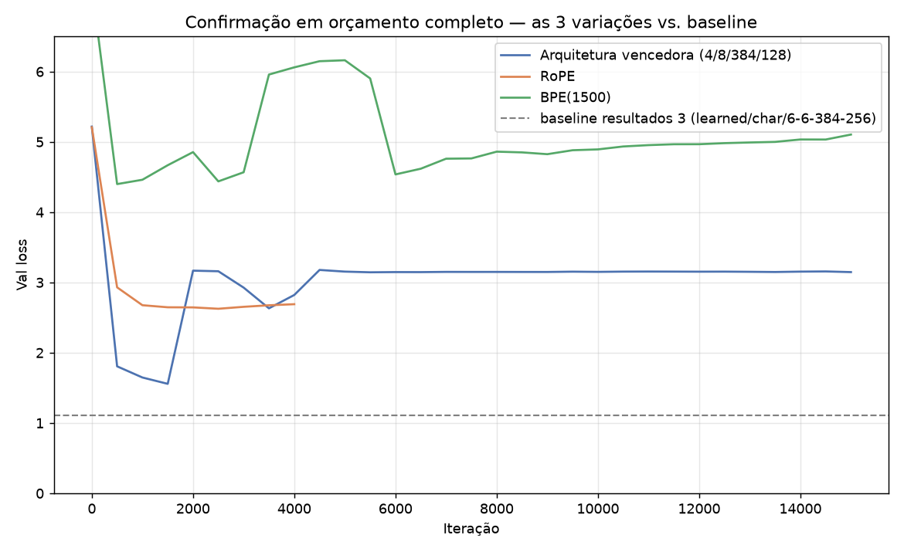

# Resultados 4 — Busca de melhorias + confirmação em orçamento completo (Projeto Individual 1, PPMEC0070)

**Diferente de `resultados 1/2/3/`, este não é o relato de uma rodada bem-sucedida — é o relato honesto de uma busca que pareceu promissora em orçamento curto e **falhou ao ser confirmada** em orçamento completo.** O resultado científico aqui não é "achamos um modelo melhor", é "achamos os limites do nosso pipeline de treino em MPS, de um jeito reprodutível e diagnosticável". Isso também é um resultado válido — e relevante o suficiente pra entrar no artigo como discussão de limitações/metodologia.

**Conclusão em uma frase: `resultados 3/` (val loss 1,1040, sem instabilidade) continua sendo o melhor resultado validado do projeto.** Nenhuma das três melhorias candidatas se confirmou em orçamento completo.

## a) Duas fases, dois orçamentos diferentes

1. **Busca (`hpsearch/`)** — k-fold por obra, orçamento curto (3000 iterações), usada só pra *rankear candidatos* entre si, nunca como número final. Três eixos testados separadamente: arquitetura/hiperparâmetros (`run_search.py`), embedding posicional (`run_embedding_comparison.py`), tokenização (`run_tokenization_comparison.py`). Ver `../hpsearch/`, cada script tem os detalhes documentados nos comentários.
2. **Confirmação (`run_confirmation_variants.py`)** — split 90/10 padrão (mesma metodologia de `resultados 1/2/3`), orçamento completo (15000 iterações), pra ver se os vencedores da busca se sustentam fora do k-fold curto. **É aqui que os três falharam.**

## b) Fase 1 — o que a busca (orçamento curto) sugeriu

| Eixo | Candidato vencedor | Métrica (k-fold, 3000 iters) | vs. baseline |
|---|---|---|---|
| Arquitetura | `n_layer=4, n_head=8, n_embd=384, block_size=128, dropout=0.3` | val loss médio 1,61 | vs. 2,92 do concorrente |
| Embedding posicional | RoPE | val loss médio 2,76 | vs. 3,07 (learned/atual) |
| Tokenização | BPE(1500, treinado no corpus) | BPC médio 3,59 | vs. 4,10 (char/atual) |

Os três pareciam vitórias claras. **Um detalhe que passou despercebido na hora, mas é relevante em retrospecto:** no k-fold do RoPE, o fold 1 já tinha um valor bem pior (3,13) que os folds 0 e 2 (2,61 e 2,54) — um primeiro sinal de instabilidade ocasional que não foi investigado a fundo antes de escalar pro orçamento completo.

## c) Fase 2 — confirmação em 15000 iterações: os três falharam

| Variação | Val loss final | Val loss (melhor antes de falhar) | Divergiu (nan)? |
|---|---|---|---|
| **arch** (arquitetura vencedora sozinha) | 3,1471 | 1,5573 (iter ~1500) | Não (nan), mas colapsa igual |
| **rope** (RoPE sozinho) | **nan** | 2,6256 (iter ~2500) | **Sim — nan a partir da iteração ~4200** |
| **bpe** (BPE sozinho) | 5,1044 | 4,3995 (iter ~2500) | Não (nan), oscila sem convergir |
| **all3** (os três juntos) | — | — | **Não rodado** — interrompido de propósito depois de ver os 3 resultados acima (ver seção e) |
| *baseline (`resultados 3`)* | *1,1040* | *1,1040 (iter 15000, ainda caindo)* | *Não* |

**Nenhuma das três variações terminou perto do baseline.** Os padrões de falha, vistos nas curvas individuais:

- **[`loss_curve_rope.png`](loss_curve_rope.png)** — treina normal até a iteração ~4000 (val loss 2,63, já pior que o baseline mas caindo), depois **vira `nan` de forma permanente** a partir da iteração ~4500 e nunca recupera — 72% do orçamento de treino desperdiçado num modelo morto.
- **[`loss_curve_arch.png`](loss_curve_arch.png)** — chega a um ponto bom na iteração 1500 (val loss 1,56, o mais próximo do baseline entre os três), mas na iteração 2000 sofre um salto abrupto pra ~3,17 e **fica travado nesse patamar pelas 13000 iterações restantes** — sem virar `nan`, mas sem nunca se recuperar.
- **[`loss_curve_bpe.png`](loss_curve_bpe.png)** — nunca converge de verdade: oscila entre ~4,4 e ~6,2 a rodada inteira, terminando pior (5,10) do que em pontos intermediários (4,37 na iteração 2500).

## d) Diagnóstico — causa raiz provável

**Autocast fp16 no backend MPS sem `GradScaler` de verdade.** Isso já era um risco conhecido desde que o patch de compatibilidade MPS foi aplicado ao `train.py`: o `nanoGPT` usa `torch.cuda.amp.GradScaler`, que é hardcoded pra CUDA — fora dele, funciona como no-op (sem proteção real contra overflow/underflow de gradiente). Em CUDA, o `GradScaler` existe exatamente pra evitar isso; no MPS, ficamos sem essa rede de segurança.

A busca (3000 iterações) não durou o suficiente pra revelar isso — o baseline (`resultados 3`) treinou 15000 iterações sem problema, mas é a única combinação validada nesse orçamento longo. Qualquer uma das três mudanças (arquitetura nova, RoPE, BPE) altera a paisagem de gradientes o suficiente pra, mais cedo ou mais tarde ao longo de 15000 iterações, produzir um gradiente grande demais pro fp16 sem escala — resultando em `nan` (RoPE) ou num salto destrutivo que danifica os estados do otimizador Adam permanentemente (arch, bpe).

**Isso não invalida os achados da busca em si** — arquitetura/RoPE/BPE continuam candidatos genuinamente promissores em orçamento curto — só invalida a confirmação em orçamento longo *nas condições atuais* (fp16 sem proteção). O caminho correto não é insistir nessas 15000 iterações com mais sorte, é **desligar o autocast fp16 (rodar em float32 puro) pras rodadas de confirmação** — mais lento, mas numericamente seguro. Isso ainda não foi feito (ver pendências).

## e) Por que `all3` não foi rodado

Depois de ver `arch`, `rope` e `bpe` falharem **cada um isoladamente**, rodar `all3` (que combina os três) não teria valor — a probabilidade de também colapsar é alta, e mais ~1,5-2h de MacBook rodando sob carga alta (temperatura observada subindo durante as rodadas anteriores) não se justificava pra um resultado que já era previsível. Interrompido de propósito.

## f) Leitura qualitativa (checkpoints do melhor ponto, antes de cada colapso)

Amostras geradas com `sample.py`, prompt "Capitulo", a partir do checkpoint salvo no melhor val loss de cada variação (não do estado final, que é `nan`/danificado):

**`arch`** (iter ~1500, val loss 1,56):
> Capitulo, paginaria alguma sobre e acesconsecar a outra cousava que fazee resolver a senhora lento da casa de lingua: "Foi um valento olhos todos, e a ventura a parte fosse de três casos de este seu subsinuo

**`rope`** (iter ~2500, val loss 2,63):
> Capitulo ro giinpo ras urirrrio ate te comseceora o dui erranva ecastanee ro o rem vede a a maga u sica gio dalcarqonra sodo maenda u évurptou as-me ie ota Larassasro remme. tiu o a otome e se o ulo a iduim

A diferença de qualidade entre os dois bate exatamente com a diferença de val loss (1,56 vs 2,63): `arch` ainda produz fragmentos de palavras em português reconhecíveis; `rope`, nesse ponto, já é quase ruído. Nenhuma amostra chega perto da qualidade de `resultados 3/` (val loss 1,10) — esperado, já que nenhuma dessas variações treinou por completo. BPE não amostrado aqui (o `meta.pkl` gerado pra essa rodada guarda só `vocab_size`, sem o mapa `stoi`/`itos` que o `sample.py` precisa pra decodificar — ficaria pra uma correção futura, não essencial pro diagnóstico principal).

## g) Bug encontrado e corrigido durante a análise

O parser de log de `run_confirmation_variants.py` usava uma regex (`[\d.]+`) que não reconhecia a string `"nan"` como número — então, quando o RoPE divergiu, o script **silenciosamente reportava o último valor numérico válido (iteração 4000) como se fosse o resultado final**, escondendo o colapso completo. Corrigido (regex agora aceita `nan`, e o CSV tem uma coluna `divergiu` explícita) — mas vale registrar: o primeiro número que o script mostrou pro RoPE (val loss final "2,69") **era enganoso**. A tabela na seção c) acima já reflete o valor corrigido.

## h) Pendências / próximos passos

- [ ] **Desligar autocast fp16 (fp32 puro) e re-rodar as 4 variações** (`arch`, `rope`, `bpe`, `all3`) — só assim dá pra saber se os candidatos da busca realmente melhoram o resultado, ou se a busca k-fold curta simplesmente não é preditiva o suficiente pro orçamento completo. **Não rodado ainda** — decisão consciente de não sobrecarregar a máquina agora (ver seção e).
- [ ] Se/quando rodar em fp32: esperar mais lento que os patches de velocidade documentados (que dependem do autocast) — outra vez o trade-off velocidade vs. corretude, dessa vez decidido a favor de corretude.
- [ ] Corrigir o `meta.pkl` da rodada BPE pra incluir `stoi`/`itos`, se quiser amostras de texto dessa variação no futuro.
- [ ] Usar esta pasta (`resultados 4/`) no artigo como seção de **limitações/discussão metodológica** — é um achado genuíno sobre os riscos de busca de hiperparâmetros em orçamento reduzido + treino misto-precisão sem proteção adequada, não só um "resultado negativo" a esconder.
